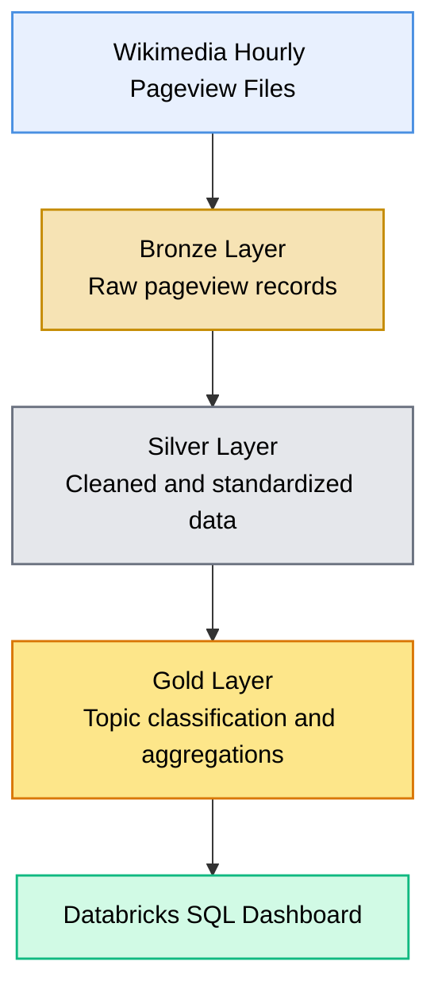
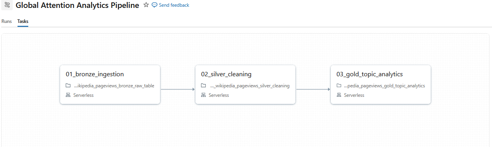
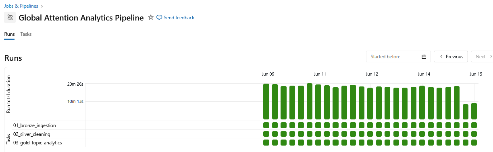

# Global Attention Analytics

## Wikipedia Pageview Trends with Databricks

An automated data engineering and analytics project that processes hourly Wikimedia pageview data using Databricks, PySpark, Delta Lake, and Databricks Workflows.

The project uses a Bronze, Silver, and Gold Lakehouse architecture to transform raw Wikimedia pageview files into analytics-ready datasets and an interactive Databricks SQL dashboard.

## Project Overview

Wikipedia pageviews provide a useful signal for understanding which topics attract public attention at a specific point in time.

This project automatically downloads and processes hourly Wikimedia pageview data for a defined group of topics. The resulting datasets make it possible to compare topic popularity, analyze hourly attention trends, examine device usage, and identify the most frequently viewed pages within each topic.

The pipeline runs automatically every six hours and processes a rolling twelve-hour data window.

## Project Objectives

* Build an automated ingestion pipeline for Wikimedia pageview data
* Apply a Bronze, Silver, and Gold Lakehouse architecture
* Process and transform large hourly pageview files with PySpark
* Store curated datasets as Delta tables
* Automate the pipeline with Databricks Workflows
* Create an interactive analytics dashboard with Databricks SQL
* Analyze topic rankings, hourly trends, device usage, and top pages

## Architecture



## Technology Stack

* Databricks
* Apache Spark
* PySpark
* Python
* Delta Lake
* Databricks SQL
* Databricks Workflows
* Wikimedia Pageview Data
* Git
* GitHub

## Data Pipeline

The project follows a medallion architecture with three processing layers.

### Bronze Layer

The Bronze layer downloads the latest twelve completed Wikimedia hourly pageview files after a three-hour safety delay.

It retains English Wikipedia desktop and mobile records, adds source metadata, and stores the resulting raw records in the Delta table:

`workspace.wiki_bronze.pageviews_raw`

The table is refreshed as a rolling twelve-hour snapshot during each pipeline run.

### Silver Layer

The Silver layer cleans and standardizes the raw records.

It creates timestamp and access-method fields, improves page-title readability, removes invalid records, and excludes technical Wikimedia namespaces and unsuitable pages.

The cleaned records are stored in:

`workspace.wiki_silver.pageviews_clean`

Topic classification is intentionally handled later in the Gold layer.

### Gold Layer

The Gold layer applies configurable rule-based topic classification and creates datasets optimized for dashboard queries.

To improve performance on Databricks Serverless compute, topic rules are first matched against distinct page titles. The resulting matches are materialized in the helper table:

`workspace.wiki_gold.topic_matches`

This prevents the full regular-expression matching process from being repeated for every hourly record and downstream aggregation.

The Gold layer creates datasets supporting:

* Topic rankings
* Hourly pageview trends
* Mobile and desktop comparisons
* Top pages by topic
* Distinct matched-article counts
* Current data-window monitoring

## Automation

The pipeline is orchestrated as a three-task Databricks Workflow running on Serverless compute:

1. **Bronze ingestion** downloads and structures the latest Wikimedia pageview files.
2. **Silver cleaning** standardizes the records and removes technical or unsuitable pages.
3. **Gold topic analytics** applies configurable topic rules and creates dashboard-ready Delta tables.

Each task starts only after the previous task has completed successfully. The workflow runs every six hours, at fifteen minutes past the scheduled hour.



### Scheduled Pipeline Runs

The automated workflow refreshes the rolling twelve-hour dataset every six hours.

After optimizing topic classification by matching distinct page titles only once and materializing the results as a Delta helper table, recent pipeline runs complete in approximately eight to nine minutes.




## Dashboard

The Databricks SQL dashboard provides a continuously updated view of public attention across six selected global topics.

It includes topic rankings, desktop and mobile comparisons, hourly attention trends, and an interactive selector for exploring the most viewed Wikipedia pages within each topic.

The current topic set includes:

- 2026 FIFA World Cup
- Artificial Intelligence
- Ukraine
- Space & Astronomy
- Climate Change
- Bitcoin / Crypto

### Topic Overview


### Hourly Trends and Top Pages


## Repository Structure

```text
wikipedia-pageview-analytics/
│
├── README.md
│
├── notebooks/
│   ├── 01_wikipedia_pageviews_bronze_raw_table.ipynb
│   ├── 02_wikipedia_pageviews_silver_cleaning.ipynb
│   └── 03_wikipedia_pageviews_gold_topic_analytics.ipynb
│
├── sql/
│   └── dashboard_queries.sql
│
├── screenshots/
│   ├── dashboard_01.png
│   ├── dashboard_02.png
│   ├── pipeline.png
│   └── pipeline_tasks.png
│
└── .gitignore
```


## Data Source

The project uses hourly Wikimedia pageview data published by the Wikimedia Foundation.

The raw pageview files are not stored in this repository. They are downloaded automatically by the Databricks ingestion pipeline.

## Key Engineering Features

- Automated ingestion of hourly Wikimedia data
- Rolling twelve-hour processing window with a three-hour availability delay
- Bronze, Silver, and Gold Lakehouse architecture
- PySpark transformations and Delta Lake storage
- Configurable rule-based topic classification
- Materialized title-to-topic matching for faster Serverless execution
- Full UTC timestamps across date boundaries
- Three-task Databricks Workflow with dependent tasks
- Scheduled execution every six hours
- Interactive Databricks SQL dashboard
- Topic-specific parameter control for the Top Pages visualization

## Future Improvements

* Extend the historical data range
* Add anomaly detection for sudden attention spikes
* Add pipeline failure notifications
* Compare Wikipedia activity with external news events
* Build a public Streamlit frontend
* Add automated data quality reporting

## Author

**Ernö Szabo**

Data Analytics · Data Science · Data Engineering
