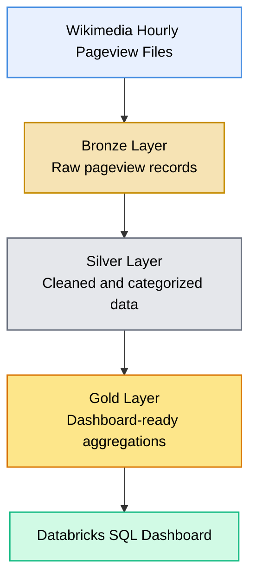
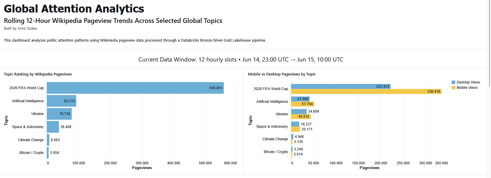
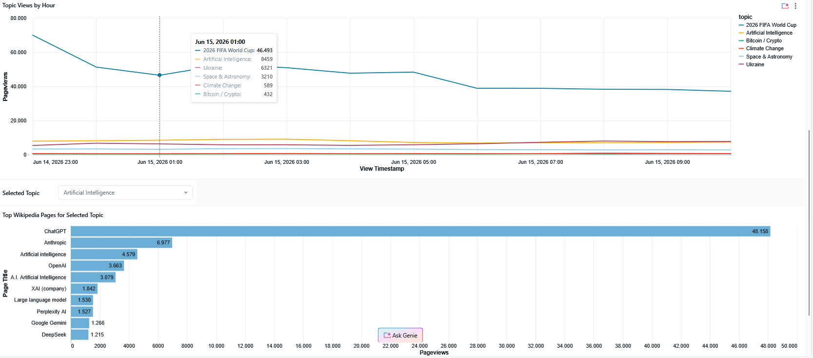

# Global Attention Analytics

## Wikipedia Pageview Trends with Databricks

An automated data engineering and analytics project that processes hourly Wikimedia pageview data using Databricks, PySpark, Delta Lake, and Databricks Workflows.

The project uses a Bronze, Silver, and Gold Lakehouse architecture to transform raw Wikimedia pageview files into analytics-ready datasets and an interactive Databricks SQL dashboard.

## Project Overview

Wikipedia pageviews provide a useful signal for understanding which topics attract public attention at a specific point in time.

This project automatically downloads and processes hourly Wikimedia pageview data for a defined group of topics. The resulting datasets make it possible to compare topic popularity, analyze hourly attention trends, examine device usage, and identify the most frequently viewed pages within each topic.

The pipeline runs automatically every six hours and processes a rolling twelve-hour data window.

## Project Objectives

* Build an automated ingestion pipeline for Wikimedia pageview data
* Apply a Bronze, Silver, and Gold Lakehouse architecture
* Process and transform large hourly pageview files with PySpark
* Store curated datasets as Delta tables
* Automate the pipeline with Databricks Workflows
* Create an interactive analytics dashboard with Databricks SQL
* Analyze topic rankings, hourly trends, device usage, and top pages

## Architecture



## Technology Stack

* Databricks
* Apache Spark
* PySpark
* Python
* Delta Lake
* Databricks SQL
* Databricks Workflows
* Wikimedia Pageview Data
* Git
* GitHub

## Data Pipeline

The project follows a medallion architecture with three processing layers.

### Bronze Layer

The Bronze layer downloads hourly Wikimedia pageview files and stores the relevant raw records in Delta tables.

The ingestion process uses a rolling twelve-hour window so that the dashboard always contains recent pageview activity.

### Silver Layer

The Silver layer cleans and standardizes the raw records.

Pages are assigned to predefined topics, unnecessary records are removed, and fields such as project, page title, access type, pageviews, and timestamp are prepared for analysis.

### Gold Layer

The Gold layer creates aggregated datasets optimized for dashboard queries.

The resulting tables support:

* Topic rankings
* Hourly pageview trends
* Mobile and desktop comparisons
* Top pages by topic
* Current data-window monitoring

## Automation

The pipeline is orchestrated through a Databricks Job containing three dependent tasks:

1. Bronze ingestion
2. Silver transformation
3. Gold aggregation

The job runs automatically every six hours.

Each processing step starts only after the previous task has completed successfully.

## Dashboard

The Databricks SQL dashboard provides a continuously updated view of public attention across six selected global topics.

It includes topic rankings, desktop and mobile comparisons, hourly attention trends, and an interactive selector for exploring the most viewed Wikipedia pages within each topic.

### Topic Overview



### Hourly Trends and Top Pages




## Repository Structure

```text
wikipedia-pageview-analytics/
│
├── README.md
├── notebooks/
│   ├── 01_bronze_ingestion.py
│   ├── 02_silver_transformation.py
│   └── 03_gold_analytics.py
│
├── sql/
│   └── dashboard_queries.sql
│
├── images/
│   ├── dashboard_overview.png
│   ├── databricks_workflow.png
│   └── architecture.png
│
├── docs/
│   └── data_dictionary.md
│
└── .gitignore
```

## Data Source

The project uses hourly Wikimedia pageview data published by the Wikimedia Foundation.

The raw pageview files are not stored in this repository. They are downloaded automatically by the Databricks ingestion pipeline.

## Key Engineering Features

* Automated ingestion of hourly data
* Rolling twelve-hour processing window
* Bronze, Silver, and Gold Lakehouse architecture
* Delta Lake storage
* Multi-task Databricks Workflow
* Scheduled execution every six hours
* Dashboard-ready Gold tables
* Interactive Databricks SQL analytics

## Future Improvements

* Extend the historical data range
* Add anomaly detection for sudden attention spikes
* Add pipeline failure notifications
* Compare Wikipedia activity with external news events
* Build a public Streamlit frontend
* Add automated data quality reporting

## Author

**Ernö Szabo**

Data Analytics · Data Science · Data Engineering
